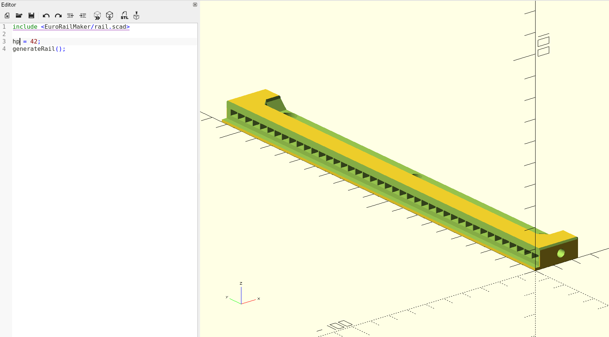
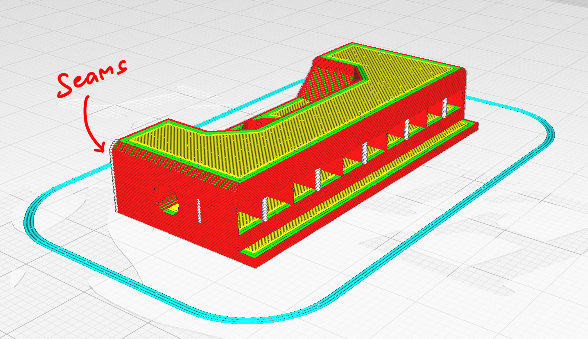

# EuroRailMaker

Make Eurorack rails using OpenSCAD.

```
include <EuroRailMaker/rail.scad>
hp = 42;
generateRail();
```



## How to use

#### Step 1: Copy the `EuroRailMaker` folder into your project directory

#### Step 2: Include the `rail.scad` file into your project.
```
include <EuroPanelMaker/panel.scad>
```

#### Step 3: Define variables
Set length in HP
```
include <EuroPanelMaker/panel.scad>
hp = 4;
```

Set length in mm
```
include <EuroPanelMaker/panel.scad>
length = 100;
```
 
#### Step 4: Call the generateRail function
```
include <EuroPanelMaker/panel.scad>
length = 100;
generateRail();
```

## Tips
When slicing, I recommend you place the seams behind the rail (the one opposite from where the panels go). In Cura, I do this by changing the `Z Seam Position` to `Back Right`.


